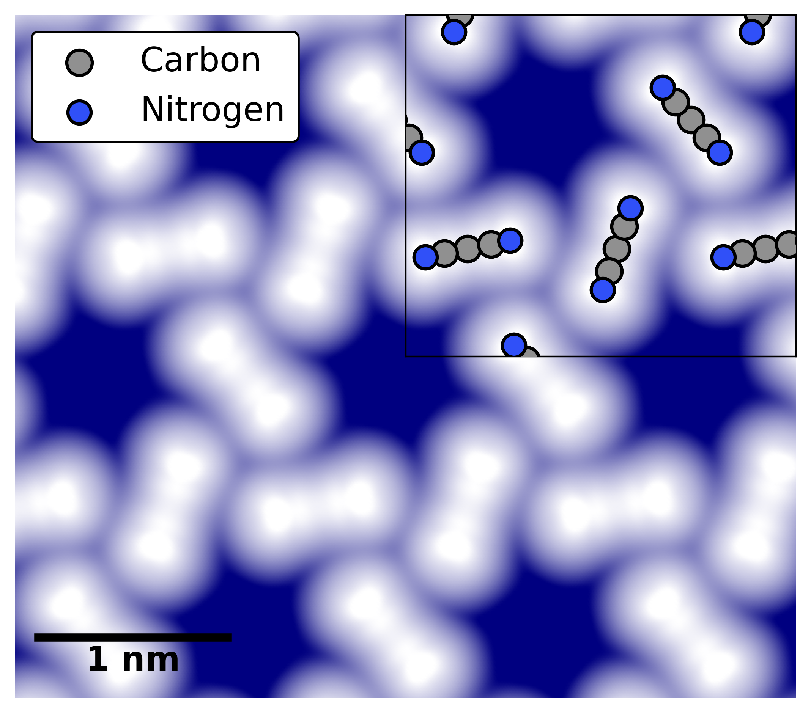

# Introduction

CubeSTM is a tool to simulate STM images from `.cube` files.

Assuming constant density of states (DOS) at the tip and constant potential barrier height, the tunneling current is proportional to:
```math
I \propto e^{-\alpha z}\int_{0}^{eV}\rho(r,E)dE,
```
where $\alpha$ is an intrinsic parameter related to the mass of the electron $m$ and the barrier height $\phi$: $\alpha = \frac{2\sqrt{2m\phi}}{\hbar}$.

The output STM `.cube` file from DFT tools such as FHI-aims contains the volumetric data of the integrated local electron density from the Fermi level to the applied voltage, e.g.
```math
V(r)=\int_{0}^{eV}\rho(r,E)dE.
```
So by accounting for the exponential factor, we are able to simulate the tunneling current from the `.cube` volumetric data.

The magnitude of the tunneling current in CubeSTM is calculated in the following way:
```math
I = \sum_{z}\sum_{xy}\exp(-\alpha_z * d_z)\exp(-\alpha_{xy} * d_{xy})V(r),
```
where the summation over $z$ runs over all voxels below a user input `height`, and the summation over $xy$ runs over all voxels within a user input `neighbourhood`. $d_z$ is the distance in z direction from the current point to the user input `height`:
```math
d_z = r_z - z,
```
$d_{xy}$ is the distance in the x-y plane from the current point to the scanned point:
```math
d_{xy} = \vec{r_{xy}} - \vec{xy}.
```
The decaying parameter $\alpha_z$ and $\alpha_{xy}$ are controlled separately by user input parameter `z_decay` and `xy_decay`. The stronger the decaying parameter, the less contribution from voxels far away from the current scanning point. As a result, a large `xy_decay` gives similar results as a small `neighbourhood`.

Last but not least, in order to show the electron clouds far away from the atoms, a logrithm normalization scheme is recommended. This is control by the `cnorm` parameter in the function. It can be `cnorm = 'normal'` to visualize the localized electron clouds, or `cnorm = 'log'` to visualize the overall electron clouds which resembles the experimental STM image.

**Before running CubeSTM, please make sure:**
1. The *x* and *y* lattice vectors of the volumetric data in `.cube` file is the same as the original atomic structure. 

   *This is to make sure the atoms and the supercell are plotted correctly. The program still generates a plot if the lattice vectors do not match, but the supercell will not look good.*
2. The lattice vectors should be of the form:
   ```math
   \begin{bmatrix} x_1 & x_2 & 0 \\ y_1 & y_2 & 0 \\ 0 & 0 & z_3 \end{bmatrix}.
   ```

# Usage

The execution of CubeSTM is straightforward:
1. Import the class
```python
from cubestm import CubeSTM
```
2. Read files and create instance
```python
cube_path = './data/cube_001_stm_01.cube'
geo_path = './data/geometry.in'
instance = CubeSTM(cube_path, geo_path)
```
3. Make the plot
```python
instance.plot(show_atoms=['C','N'],
              z_decay=1.6,
              neighbourhood=4,
              xy_decay=1.5,
              vmin=1e-4,
              vmax=0.4,
              inset_size=0.45,
              atoms_size=1.2,
              atoms_edge=1.5)
```


Note that there are no required parameters for the functions `plot()` and `plot_cell()`. However, by tunning the parameters one can create an image close to the experimental one.
